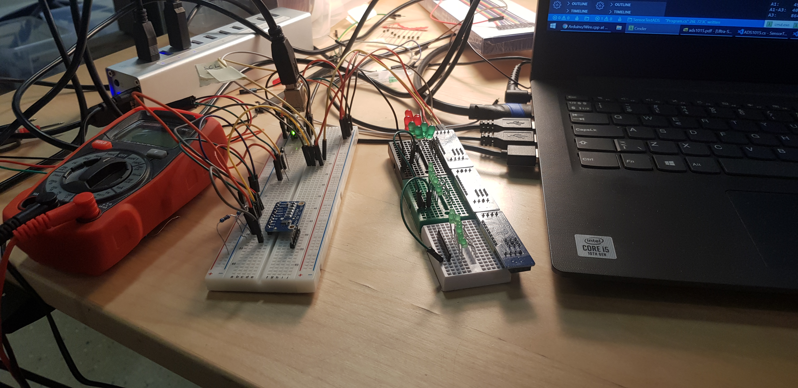
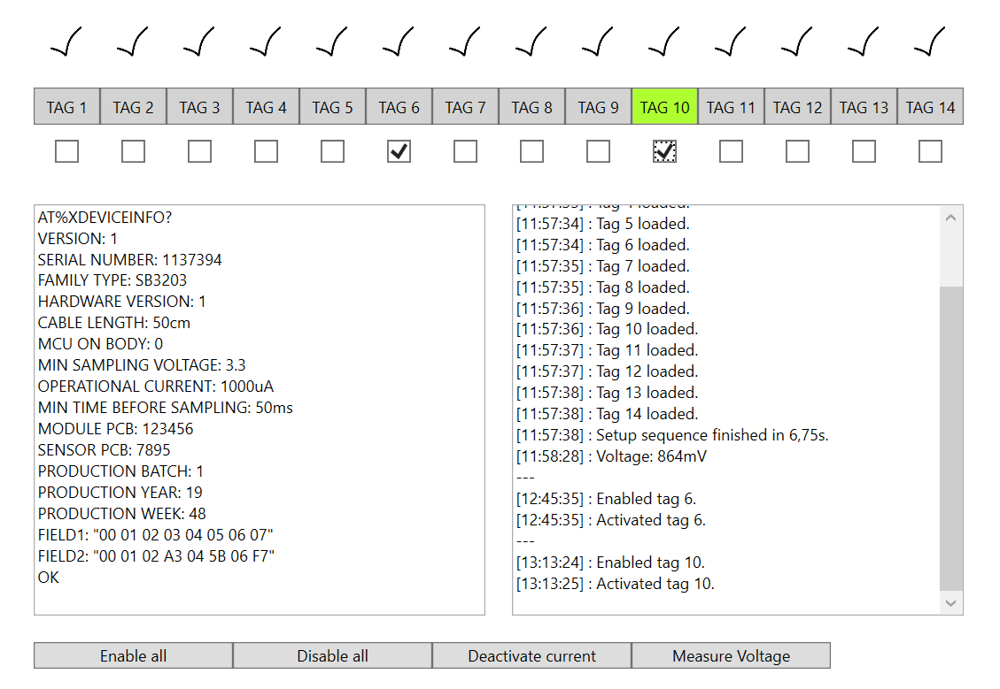

# Vecka 18

## Måndag 27 apr

Fick en grundläggande överblick över hårdvaran som Sensorbee utvecklar och vad för uppgifter jag förväntas lösa. David vill ha en GUI som ger en överblick över systemet Sensorbee har utvecklar för att enhetstesta deras sensorer. Blev introducerad till [I2C](https://en.wikipedia.org/wiki/I%C2%B2C)-protokollet, som används som gränssnitt mellan PC och kretskortet, samt [Docklight](https://docklight.de/), ett scriptingprogram för seriell kommunikation med inbyggda system. Spenderade dagen med att experimentera mha ett breadboard och I2C-baserade master-/slavmoduler. Slavmodulerna adresseras med 3 bits (0 till 7) och håller en byte av data, vilket är tänkt ska skickas vidare till kretskortet för att styra dess beteende. Började utveckla C#-kod för att kommunicera med hårdvaran via USB mha Docklights DLL.

## Tisdag 28 apr

Sprang på problem med Docklight-DLL:en, så jag ersatte den (temporärt?) med `System.IO.Ports` för att skriva och läsa bytes direkt till mastermodulen. Skrev ett C#-bibliotek som abstraherar läs- och skrivprocessen och låter mig skriva t.ex.

```
Slave s = new Slave(0); // slavmodul med adress 0
s.Write(0xff);
```

för att adressera en slavmodul och skriva en byte till den. Skrev också ett minispråk med en interaktiv tolkare för att kunna testa biblioteket dynamiskt, t.ex.

```
> write 0 255
> toggle 0 4   # flippa 4:e biten
> read 0
239
```

David har varit väldigt välkomnande och han ger mig mycket rum att experimentera på egen hand och bidra med egna idéer.

## Onsdag 29 apr

Lade till `LogicalUnit`-klassen som abstraherar bort enskilda slavmoduler och låter mig adressera en serie av bits som en enhet. T.ex. kan jag hantera de sista 4 bits av en slavmodul och de 4 första av en annan som om de vore ett självständigt sammanhängande enhet.

Faktorerade om koden för att dela bibliotekskod från front-end (ovannämnda tolkaren samt eventuell GUI). Började experimentera med WPF för att skriva en GUI.

## Torsdag 30 apr

Fortsatte utveckla GUI:n. Lärde mig om [Hayes-kommandon](https://en.wikipedia.org/wiki/Hayes_command_set) som kommer användas för att programmera och hämta information från sensorerna via en separat port, och började lägga till den funktionaliteten till kodbasen. Hårdvaran för kretskortet ankommer nästa vecka så mina möjligheter att testa min kod har varit begränsade den här veckan, men jag är nöjd med hur det har gått hittills och David är nöjd med min insats.

Det har varit en lärorik vecka och jag har fått testa många saker jag är relativt oerfaren i: digitalteknik, skriva till/läsa från fysiska portar, designa och implementera en GUI, och framför allt designa ett komplext program utifrån ett kravspecifikation. En stor utmaning har varit att hantera logistiken av olika .NET-versioner, DLL-importer och kompatibilitet, ladda ner bibliotek med pakethanterare, osv, vilket jag inte har mycket erfarenhet av från de relativt små uppgifter vi får i skolan.

# Vecka 19

## Måndag 4 maj

Fortsatte förfina och debugga GUI:n jag började arbeta med förra veckan. Jag studerade också databladet för en I2C-baserad analog-digitalomvandlare ([ADS1015](https://www.adafruit.com/product/1083)) som mitt program ska styra.

## Onsdag 6 maj

Hemma igår pga sjukdom. Experimenterade med ovannämnda ADC:n mha kretskortet jag har byggt under praktiken och implementerade den i mitt C#-program, vilket tog större delen av dagen. Programmet kan nu räkna ut voltskillnader mellan två pins, vilket (enligt David) kommer vara användbart i testkortet. Jag ser fram emot att få testa mitt program på riktiga hårdvaran.



## Torsdag 7 maj

Jag spenderade dagen med att finslipa GUI:n i väntan på att hårdvaran skulle byggas färdigt. På eftermiddagen hjälpte jag till med att löda några kretskort, vilket var en underhållande distraktion. Imorgon är kortet förhoppningsvis färdigt och jag kan börja nästa fas av utveckling.



## Fredag 8 maj

Idag fick jag spendera hela dagen med att löda systemets huvudkort. Efter att jag upptäckte en bugg på eftermiddagen i den behövde jag försiktigt fräsa och patcha den. Trots att det inte blev någon programmering idag är jag rätt nöjd med att jag fick öva lödning. Jag har lärt mig rätt mycket om digitalteknik de här två veckorna. Det blir hjälpsamt om jag någonsin jobbar med inbyggda system igen i min framtida karriär.

# Vecka 20

## Mån 11

Jag spenderade lite tid på helgen med att skriva om delar av mitt program i [Go](https://golang.org/), ett C-liknande språk jag har nyligen upptäckt och blivit förtjust i. Jag gjorde det dels som en ursäkt för att öva Go, men jag känner också att koden som jag har skrivit har blivit för stor och rörigt. Stora delar av det härstammar från mina första 2-3 dagar då jag experimenterade med mitt breadboard och endast till hälften riktigt förstod mitt programs syfte. Att skriva om programmet i Go har hjälpt mig förenkla min egna mentala modell av koden och implementera den mer koncist.

Så idag började jag skriva om C#-versionen för att efterlikna Go-versionen. Översättningen var lite mer bökigt än vad jag hoppades på pga objektorienterade strukturen av C#; Go är mycket simplare och C-likt. Imorgon vill jag fortsätta refaktorera C#-versionen och utforska möjligheten att göra en GUI-frontend för Go-versionen. Eventuellt kan Go-versionen ersätta C#-versionen, om David går med på det.

Jag fortsatte också löda huvudkortet idag och kom tillräckligt långt för att koppla den till min dator och göra enkla tester mha [Termite](https://www.compuphase.com/software_termite.htm).
